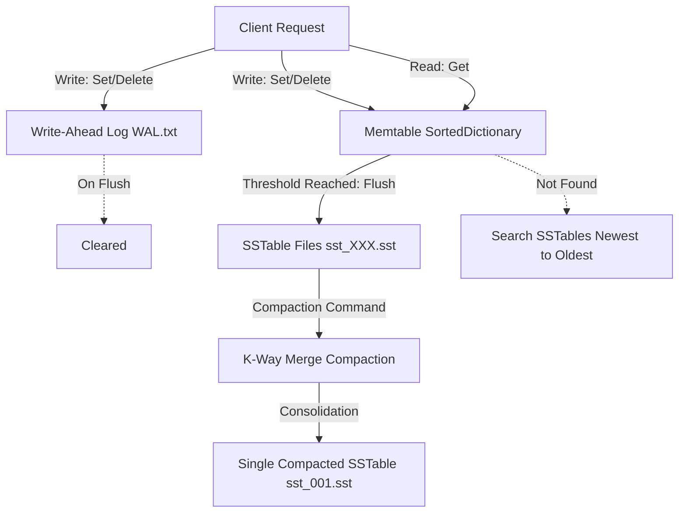

# LSM-Tree Key-Value Store

A lightweight, disk-backed key-value database engine implemented in C# utilizing the **Log-Structured Merge-tree (LSM-tree)** architecture. This project serves as an educational model demonstrating the fundamental concepts of LSM-trees, including memory buffering, write-ahead logging, immutable sorted tables on disk, and merge compaction.

---

## Architecture

The engine is built around three core layers: in-memory storage, append-only persistence, and sorted on-disk storage.

### 1. In-Memory Component: `Memtable`
* **Role**: Serves as the primary entry point for all writes and the first lookup point for reads.
* **Structure**: Backed by a `SortedDictionary<string, string>`, which keeps keys sorted in lexicographical order.
* **Lifecycle**: When the number of entries in the Memtable reaches a pre-defined threshold (default: `10`), the contents are flushed to disk as an immutable SSTable, and the Memtable is cleared.

### 2. Durability Component: `Write-Ahead Log (WAL)`
* **Role**: Ensures durability and crash recovery.
* **Mechanism**: Every mutation (`set` or `delete`) is appended to `WAL.txt` before it is applied to the Memtable.
* **Recovery**: Upon database startup, the engine reads `WAL.txt` line-by-line and replays the commands to reconstruct the in-memory state of the Memtable.
* **Flush**: Once the Memtable is successfully flushed to disk as an SSTable, the WAL is cleared (truncated).

### 3. On-Disk Component: `SSTable` (Sorted String Table)
* **Role**: Provides immutable, sorted, persistent storage on disk.
* **Structure**: Plaintext files named `sst_XXX.sst` (e.g., `sst_000.sst`), where `XXX` represents an incrementing sequence number. Each file contains line-separated key-value pairs formatted as `key|value`, sorted lexicographically by key.
* **Immutability**: Once written, SSTables are never modified. Instead, new files are created, and old files are consolidated during compaction.

---

## Algorithms and Core Techniques

### Write Path
1. **Log**: The command (e.g. `set|key|value` or `delete|key`) is appended to the WAL.
2. **Buffer**: The key-value pair is inserted into the Memtable.
3. **Threshold Check**: If the Memtable contains $\ge 10$ records, a flush is triggered:
   * The Memtable's contents are written to a new SSTable file (e.g., `sst_001.sst`).
   * The Memtable is cleared.
   * The WAL is cleared.

### Read Path
1. **Memtable Lookup**: The engine checks the Memtable first. If found (and not a tombstone), the value is returned.
2. **SSTable Scan**: If the key is not in the Memtable, the engine searches the SSTables on disk in **reverse chronological order** (from the highest numbered file to the lowest).
   * Inside each SSTable, a line-by-line scan is performed.
   * The first occurrence of the key is returned (since newer files contain more recent updates).
3. **Tombstone Handling**: If the key is associated with the deletion marker `__tombstone__`, or if the key is not found in any layer, a `(Not found)` response is returned.

### Deletions (Tombstones)
Since SSTables are immutable, deletes cannot modify data in-place on disk. 
* A deletion writes a special value called a **Tombstone** (`__tombstone__`) to both the WAL and the Memtable.
* During read operations, encountering a tombstone indicates that the key has been deleted.
* The actual removal of the deleted key and its older values occurs during **Compaction**.

### Compaction (K-Way Merge)
As new SSTables are created, read performance degrades because the engine may have to search multiple files. **Compaction** consolidates SSTables to optimize space and lookup speed.

* **Algorithm**: It uses a **K-Way Merge** using a **Min-Heap (Priority Queue)**.
* **Process**:
  1. The engine initializes an `SSTReader` for each SSTable.
  2. The first key-value pair from each reader is loaded into a priority queue, ordered lexicographically by key.
  3. The engine dequeues the smallest key across all files.
  4. Due to reverse chronological ordering, the first time a key is popped, it represents the latest version. Subsequent occurrences of the same key are discarded.
  5. If the newest version of a key is a tombstone, it is discarded entirely (not written to the output).
  6. The consolidated key-value pairs are written to a fresh `sst_001.sst` file, and all older SSTable files are deleted.

---

## CLI & Interface Commands

The system features a simple CLI interface supporting the following commands:

| Command | Arguments | Description |
| :--- | :--- | :--- |
| `set` | `<key> <value>` | Inserts or updates a key-value pair. |
| `get` | `<key>` | Retrieves the value associated with a key. |
| `delete` | `<key>` | Marks a key as deleted using a tombstone. |
| `compaction` | *(None)* | Triggers a manual compaction of all SSTables on disk. |
| `terminal` | *(None)* | Starts an interactive REPL terminal session. |
| `help` | *(None)* | Displays help information. |

### Execution Modes
1. **Single Command**: Pass command and arguments directly via CLI (e.g. `LSMTree set name Alice`).
2. **Interactive Terminal**: Run with `terminal` to enter an interactive session where you can execute multiple commands sequentially.
3. **Test Generator**: Run with `test <count>` to insert a batch of `<count>` sequential keys (`0` to `count-1`) for demonstration and load-testing.
